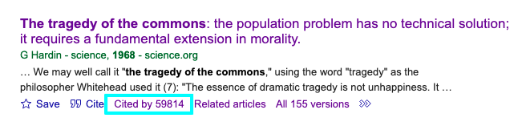
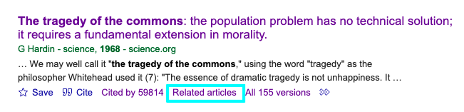
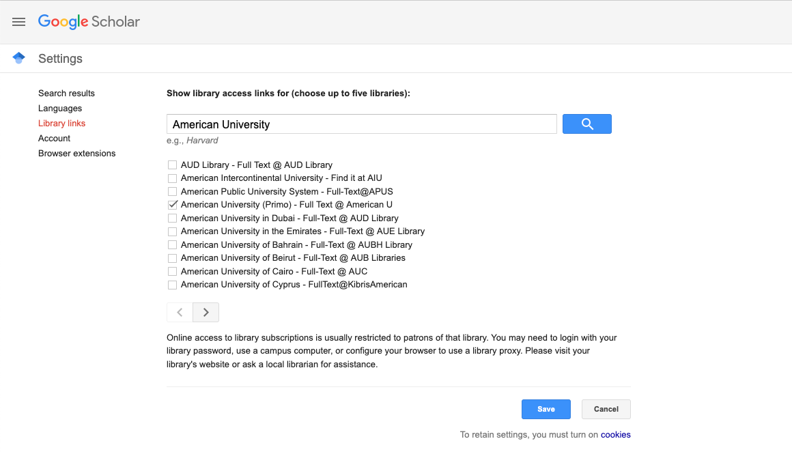

## Overview

Writing a literature review can feel overwhelming. You may find yourself unsure where to begin, what matters, or how to keep track of everything. You might also feel uncertain about what the goal of a literature review even is. This guide will walk you through how to get started with writing a literature review.

## Learning Goals

By the end of this workshop, participants will be able to:

-   Use research tools to trace scholarly connections between articles.
-   Identify related work using citation networks and recommendation tools.
-   Apply strategies for keeping a literature review focused and manageable.

## Start with Known Landmarks

A literature review is different than a traditional research paper or an annotated bibliography. The goal is not just to gather references, but to understand the conversation already happening in your field. How have other scholars approached your topic? Where do they agree or disagree? What questions still remain? Most importantly, it’s about identifying how your own research builds on, responds to, or challenges what’s already out there.

That might sound like a lot, but remember you’re not starting from scratch. You already have materials to work with: articles you’ve read in your courses, texts your advisor has pointed you toward, and the foundational works in your discipline that you keep hearing referenced. These are your entry point.

## Follow the Conversation

Begin by identifying just a few key articles you already know are important to your topic. Once you’ve identified a key article, look at who they cite and who cites them. This shows who came before and shaped their thinking and how their work has influenced others after them. This process of stringing articles together through their citations is how you trace the evolution of ideas and see how arguments are built.

## Suggested Research Tools

In the next sections, we’ll look at how there particular research tools, **Google Scholar**, **Semantic Scholar**, and **Research Rabbit**, can help you follow citation trails, discover related work, and visualize connections. Each tool will use the same example article, Garrett Hardin’s *“The Tragedy of the Commons,”* to show how the different tools reveal different parts of the scholarly conversation.

------------------------------------------------------------------------

### Google Scholar

[Google Scholar](https://scholar.google.com/) is a freely accessible search engine for scholarly literature. It includes journal articles, theses, books, preprints, and more. While not comprehensive, it’s a great starting point for identifying foundational works and following citation trails.

#### Getting Started

Begin with a reading you already know is important in your field. Here you can see the partial results of a search for Garret Hardin's "The Tragedy of the Commons" first published in Science in 1968. Remember to use quotation marks to search for exact terms and try using adding the author name or keywords, if you're having trouble finding the article you're looking for.

{fig-alt="Image of the search results for \"The tragedy of the commons\" 1968" fig-align="center"}

The phrase "tragedy of the commons" has become well used since the publication of this paper and we can see that there are a large number of versions available, so "1968" was added to the title search to narrow it down. We could have alternatively used the **Advanced Search** option (accessed through the 3 bar menu in the upper left of the screen) to fill in more specific information about the article we were looking for.

#### Use “Cited by” to Follow the Conversation

The **“Cited by”** link shows newer articles that referenced the original. Click it to trace how the work influenced later research.

{fig-alt="Image of the Google Scholar listing for The Tragedy of the Commons with the Cited by listing highlighted with a bright blue box." fig-align="center"}

You can use the **“search within citing articles”** option to limit your search to just those articles that cited your original search article.

{fig-alt="Image of the Google Scholar listing with the 'Search within citing articles' box checked and highlighted with a bright blue box." fig-align="center"}

#### Use “Related articles” to Expand Laterally

Find papers with similar topics or methods, even if they don’t cite the same sources. This helps identify tangential or emerging areas.

{fig-alt="Image of the Google Scholar result listing with the 'Related articles' link text highlighted with a bright blue box." fig-align="center"}

#### Link to AU Library to Get Full Text

{fig-alt="Image of the Google Scholar Settings menu and the Library Link options." fig-align="center"}

To set up Google Scholar for accessing AU Library materials, start at the main Google Scholar page and click on the 3 bar menu in the upper left corner:

-   From that menu, select **Settings** then **Library Links** and use the search box to look up *American University*.
-   Check the box for **American University – Full Text at American U**.
-   Then search again for Open WorldCat and check the box for **Open WorldCat – Library Search**, then click **Save**.

You’re now ready to use Google Scholar to find and access AU Library resources.

-   Adds a **“Full Text \@ American U”** to the Google Scholar search results for items available through AU.
-   This helps you avoid paywalls and broken links by connecting you to AU Library's holdings.

::: callout-box
#### Google Scholar Limitations:

-   Results are ranked by relevance, not quality
-   Includes duplicates, preprints, and non-peer-reviewed sources
:::

------------------------------------------------------------------------

### Semantic Scholar

------------------------------------------------------------------------

### Research Rabbit

------------------------------------------------------------------------

## Search Strategically

You’ll still need to use library databases to find additional literature, but now you’re searching with a clearer purpose. Instead of throwing in vague keywords, you’re looking to fill gaps in the conversation, locate more recent work, and test your understanding of the topic so far.

At this point, your subject or liaison librarian can be a valuable partner. You can [schedule a one-on-one research appointment with your subject librarian](https://www.american.edu/library/ask/index.cfm) through the library website. These sessions are collaborative and tailored to your topic. They can help you identify which databases are best for your field, develop a more strategic approach to searching, and troubleshoot common issues like getting too many irrelevant results or too few useful ones.

## Keeping Track of What You Find

As you begin gathering sources, now is the time to start using a citation manager. This software tool will help you stay organized and make your writing and citation process much easier later on.

The library provides support for [Zotero](https://www.zotero.org/), a free, open-source citation manager that allows you to save references directly from your browser, organize readings into collections or tags, generate citations and bibliographies in any citation style, and sync your research library across devices. Zotero integrates with both Microsoft Word and Google Docs, making it easy to cite while you write when you get to that step.

We recommend downloading Zotero and the browser connector before you begin intensive searching, so you can start building your research library from the start. If you’d like help getting set up or learning how to use Zotero effectively, the library offers a [LibGuide](https://subjectguides.library.american.edu/zotero) where you can learn more about using the software and get librarian assistance.

## Make Article Access Easier with LibKey Nomad

Installing LibKey Nomad, a browser extension available for Chrome, Firefox, and Edge, can save you a lot of time. Once installed, it will automatically detect when an article you’re viewing is available through the library’s subscriptions and provide a direct download link when possible.

This means that even if you’re searching Google Scholar or visiting a publisher’s website, you’ll still get seamless access to full-text articles without having to backtrack through the library’s homepage. It’s a small tool, but one that makes a big difference in your workflow.

[Instructions for installing LibKey Nomad and linking it are available on the library’s website.](https://answers.library.american.edu/faq/343608)

## A Note on Managing PDFs

When doing your literature search, it may be tempting to download every article PDF that looks remotely useful. However, we recommend taking a more selective approach. Save just the citation itself to your citation manager instead, and only download the PDF once you’re ready to read or annotate it.

This helps avoid clutter and makes it easier to manage your research library in the long run. Zotero allows you to attach PDFs to citations later, so you won’t lose anything by waiting.

## Literature Reviews Are a Learned Skill

A literature review can sometimes seem like a hoop to jump through, but it’s how you learn what your field values, what kinds of questions are still being asked, and where your work might contribute. It’s not simply about gathering sources; it’s about learning to speak the language of your discipline and beginning to stake out your own voice in the scholarly dialogue.

That’s a big task, and for many graduate students, it’s a new skill. We often only see the end results: the polished, tightly written literature reviews that appear in journal articles or books. Those are the final drafts, honed by experience and often multiple rounds of peer review. But a literature review doesn’t start out that way.

If you want a more realistic view of what a graduate-level literature review actually looks like check out [ProQuest’s Dissertations and Theses Global database](https://subjectguides.library.american.edu/global-dissertations-theses). These documents show what a literature review looks like for someone at your stage of academic development. You’ll notice longer, more exploratory writing, often with more detailed explanations than you’d find in journal articles.

And remember you’re not doing this alone. Whether you’re stuck trying to find an article, need help using a tool, or want to talk through your topic, your librarians are here to help. Reach out anytime. We’d love to work with you.
